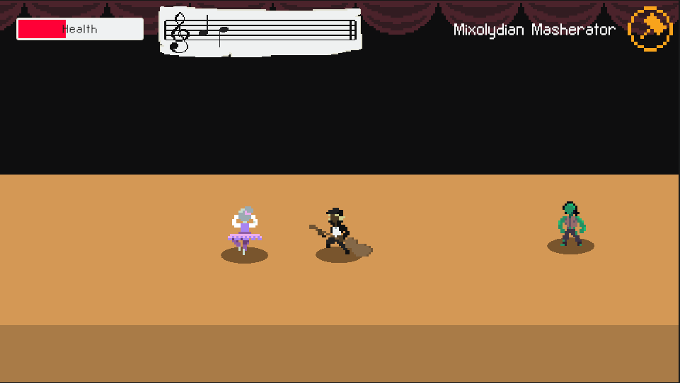

Performance day approaches for our Musical Maestro! Anxious for his big performance, the Maestro attempts to use his magical prowess to call upon an ancient spell to enchant his concert...

To his dismay, something went dreadfully wrong, unleashing a wicked Phantom upon the audience!

Now the Maestro must set things right and demonstrate his mastery of the mystic modes.

## [Play Now!](https://xangrab.github.io/ModeJam2023/)

---

_Created for Bigmode Game Jam 2023_
