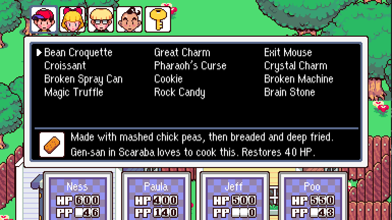


---

Released in 1995 in the West, and 1994 in Japan as MOTHER 2. MOTHER² is a full-length ground-up reimagining of the game in a new engine targeting PC and Valve handheld devices.

---
## [Find Us On X (Twitter)](https://twitter.com/mother__squared?lang=en)
