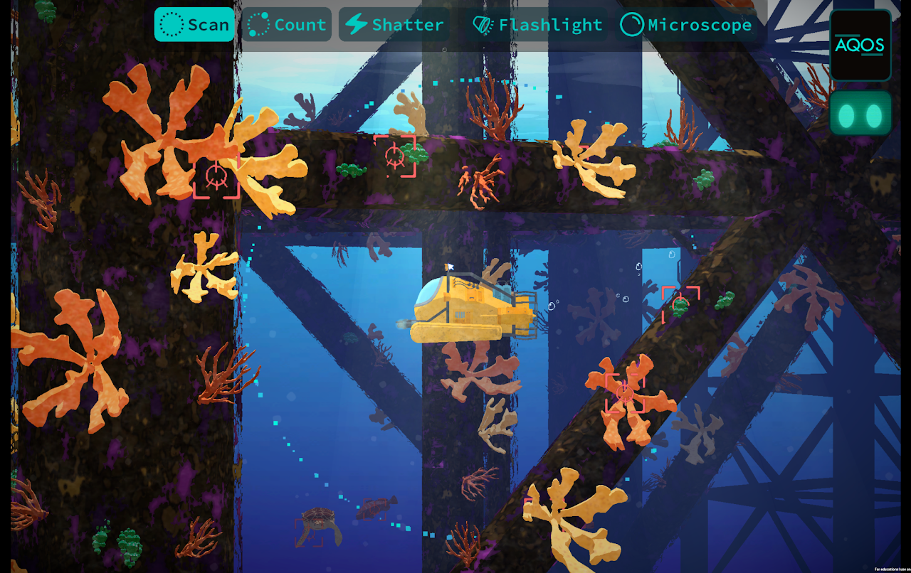


---

Play as a young scientist faced with scientific challenges across multiple oceanic ecosystems. Made in partnership with Harvard and the Penn Center for Learning Analytics. Funding provided by NSF.

## My Contributions

* Designed pivotal story and level layout elements of the
game’s introductory sequence
* Brought gameplay mechanics to life in Unity, implementing
the game’s Shop UI, and expanding upon systems in the
game’s Experiment Tanks
* Used in-house scripting language to bring the work of writers,
designers, and developers together to implement Aqualab’s
quests
* QA Testing using Trello and other in-house logging tools

---
## [Learn More About Wake](https://fielddaylab.wisc.edu/play/wake/)